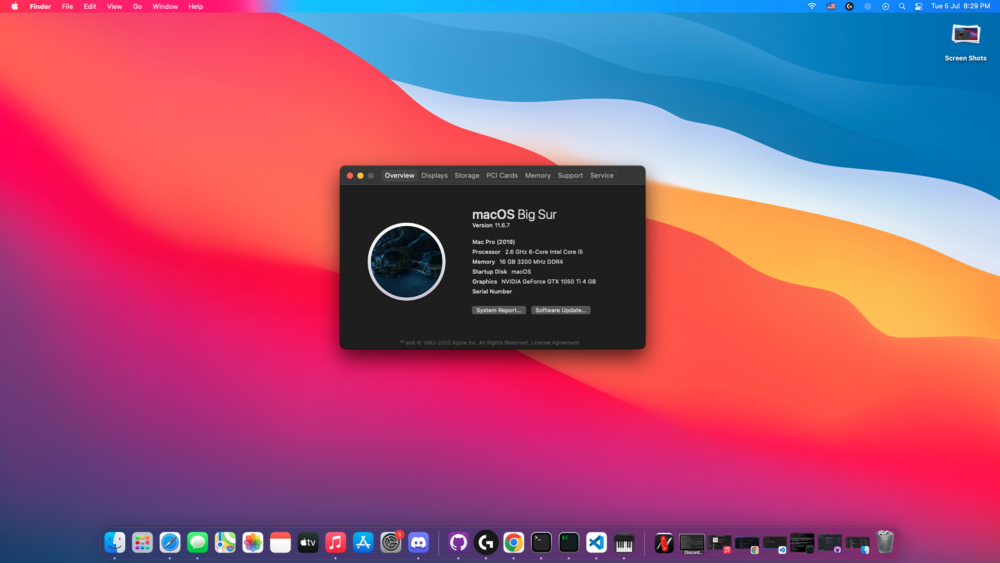

# TUF-GAMING-B560M-PLUS-WIFI-Hackintosh-OpenCore

OpenCore config for my Rocket Lake desktop that i recently built.

# Disclaimer:
* This is not a guide.
* I am by no means a pro at hackintoshing. This is my first time. There is still a lot of things to fix.
* Everything works well on Big Sur. I tried Monterey and a lot of things broke or stopped working, I also experienced random freezes.

# Info
* OpenCore 0.8.2
* ASUS Tuf Gaming B560M-Plus WiFi
* Processor: i5 11400 (11-gen)
* Nvidia Geforce GTX 1050ti (Patched using [OpenCore Legacy Patcher](https://github.com/dortania/OpenCore-Legacy-Patcher/).)
* 16 GB XPG-D50 DDR4-3200 RAM

What's working: 

* it boots 
* dual display is working with some issues
* accelerated graphics with [OpenCore Legacy Patcher](https://github.com/dortania/OpenCore-Legacy-Patcher/)(rocket lake iGPU not supported)
* sound works
* on board ethernet works
* all USB ports work
* sleep works
* WiFi works
* iServices
  * iMessage
  * FaceTime
  * iCloud
  * Siri

What's *NOT* working:

* AppleTV+ Playback (too lazy to fix)
* Bluetooth
* AirDrop/Handoff

# Issues:

* Won't boot with 2 displays connected. I have no idea why this happens, dual displays works fine if I plug it in after booting. If anyone has a fix please let me know.
* Monterey boots but has problems. (need more testing and troubleshooting)

# Credit:

* [OpenCore Legacy Patcher](https://github.com/dortania/OpenCore-Legacy-Patcher/)
* [OpenCorePkg](https://github.com/acidanthera/OpenCorePkg)
* [Dortania's OpenCore Install Guide](https://dortania.github.io/OpenCore-Install-Guide/)
* Initial config based on :https://github.com/uranium81/hackintosh-intel-11th-gen/

